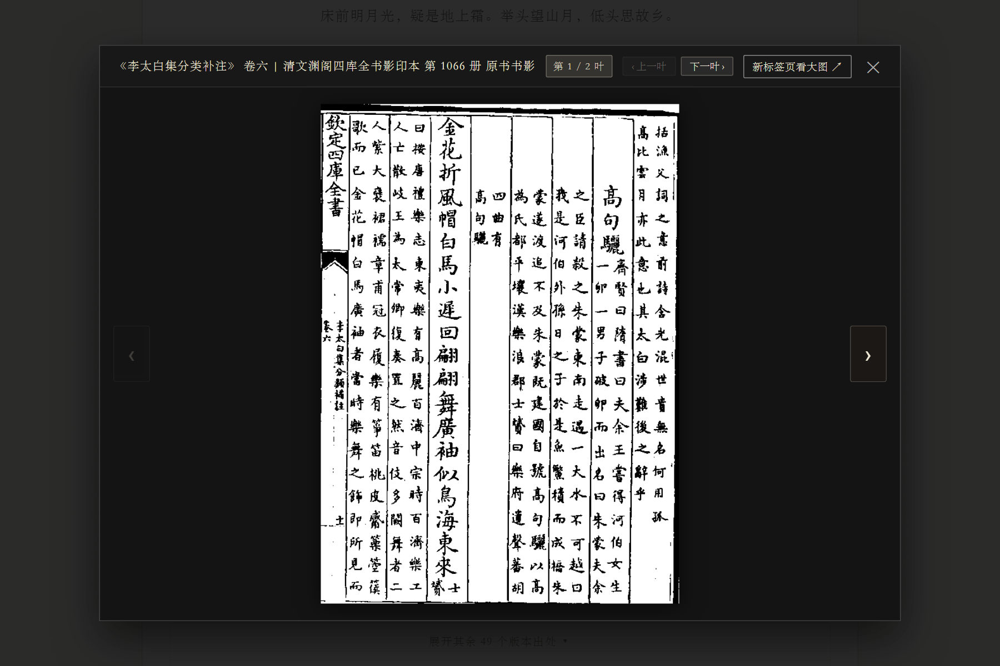

# 搜韵网收录诗文出处循证系统 (souyun-index)

<div align="center">

**古典文献底本溯源 · 同诗多源收录流变 · 历代名家汇评集释 · 原典语境透视 · 跨页书影对勘**

[](https://github.com/ATP24/souyun-index/releases)
[](LICENSE)
[](https://github.com/ATP24/souyun-index)
[](https://www.python.org/)
[](#-下载与极速上手)

[📸 界面全景](#-学术界面演示) •
[📖 立项宗旨](#-立项宗旨与痛点破解) •
[✨ 核心功能](#-系统核心功能体系) •
[🚀 极速上手](#-下载与极速上手) •
[📁 目录结构](#-项目结构规范) •
[⚖️ 学术声明](#-声明与致谢)

</div>

---

## 📸 学术界面演示 (Visual Gallery)

### 1. 宋风文人书斋检索首屏（内置 65 部权威底本书目库）
<div align="center">
  
</div>

<br>

### 2. 核心文献考信与研读矩阵（对称对比）

| 核心功能：同诗多源收录流变全景展开 | 核心功能：古籍原典载录语境全景透视 |
| :---: | :---: |
|  |  |
| **同诗多源流变**：第一手别集与权威通代总集出处矩阵全景展开 | **原典前后文**：突破断章取义，呈现原书载录语境与朱笔句读 |
| **核心功能：历代名家汇评与诗话集释** | **核心功能：跨页全景高清原书书影对勘** |
|  |  |
| **名家汇评集释**：汇集历代文人诗话批点，品鉴前贤诗法章法 | **跨页全景书影**：全屏古籍展卷灯箱，支持多叶连续翻阅与对勘 |

---

## 📖 立项宗旨与痛点破解

在中华古典文学与古代文献学研究中，“凡引古书，必辨底本；考其流变，必验语境”是历代考据学家的治学准绳。

然而在现代数字人文检索中，学者常面临深层痛点：
1. **搜韵网“有诗无本”的客观痛点**：搜韵网作为当今规模宏大、索引精准的诗词数据库，收录了浩瀚的诗词曲赋，但其常规检索界面仅呈现标准化标点文本，**完全不体现作品在现实实体典籍中的具体出处与出版底本**，研究者引用时仍需耗费海量精力二次翻检纸质类书与文集；
2. **“同诗异源”收录流变被掩盖**：同一首经典诗作，在作者独撰别集、历代官修总集、文人选本、诗话评点中往往被多次转引，且存在题名、字句乃至作者归属的版本异文。传统检索通常仅给出单一扁平文本，掩盖了历代版本存佚与传播流变；
3. **引文语境割裂与断章取义**：仅提供单句或全诗，不提供该诗被某部典籍引录时的前后文语境（上下文原书数行），无法考辨古籍编纂者的引诗意图与特定语境；
4. **跨页古籍书影查验困难**：长篇诗歌或跨页排印的古籍扫描件，在普通数字化检索工具中往往只能查看第一页，跨页部分断档割裂。

**`souyun-index`（搜韵诗文出处循证系统）** 专为古典文献学、古代文学研究者及文史学者量身打造。系统逆向激活并打通了搜韵网底层开放图谱中沉睡的实体文献关联数据，建立了一套严谨、完整、开箱即用的古典文献出处循证体系。

---

## ✨ 系统核心功能体系

### 🏛️ 核心功能一：破解“有诗无本”——搜韵诗文纸质文献出处循证溯源
* **文献逆向寻源**：深度挖掘搜韵网底层古籍知识图谱，将原本“有诗无本”的扁平检索结果，精准反向映射至历代传世善本与现代权威古籍整理出版物；
* **底本确凿可考**：清晰呈现每条出处的完整著录信息（如部类、卷次、叶码、编撰者），让每一首诗词都有确凿可查的纸质实体依据，满足国家古籍整理与现代学术论文严格的引用规范。

### 📜 核心功能二：同诗多源收录流变——历代典籍出处矩阵全景展开
* **历代收录全景展开**：针对同一首诗在传世典籍中出现的不同出处，系统彻底打破“单一来源呈现”的局限，提供一键全景展开矩阵；
* **版本存佚立体呈现**：无论是初唐沈佺期、盛唐李白、杜甫，还是宋元名家，其作品在作者本集、历代大部头总集（如《全唐诗》《文选》）、著名选本（如《唐诗品汇》《唐诗纪事》）及类书、诗话中的所有收录记录一览无余，为文本异文校勘与文学接受史研究提供全景式版本分布图谱。

### ⚖️ 核心功能三：文献考信四级加权排位算法
系统根据古籍文献学考据学原则，内置严谨的版本考信加权梯队，按版本权威性智能排定优先顺序：
* **第一梯队【第一手独撰别集】**：诗人亲撰文集或宋元明清第一手专集（如《李太白集分类补注》《杜工部集》），享有最高考信权重；
* **第二梯队【权威通代总集】**：历代正统通代总集与官修定本（如《御定全唐诗》《全宋词》《文选》《全唐文》等）；
* **第三梯队【经典历代名选】**：历代著名选本、专集与类书（如《唐诗品汇》《古诗纪》《渊鉴类函》等）；
* **第四梯队【诗话词话辑评】**：历代名家批评、诗话、笔记杂著与汇编。

### 📖 核心功能四：古籍原典前后文语境透视（现代点校整理体例）
* **文人流式连贯原典**：彻底摒弃生硬的割裂标签，采用纯粹典雅的视觉墨色体例（**松烟淡墨**呈现前后文语境，**纯正徽墨与温润底衬**自然浮现命中诗文，**传统朱砂**穿透高亮关键词句），浑然天成；
* **古籍版刻噪点彻底清整**：
  * **伪折行智能缝合**：消除古籍雕版每列固定 20 字机械折行引起的诗句腰斩，实现文句自然平滑连缀；
  * **双行小字注连缀**：OCR 双行注跨行腰斩（`)\n(`）自动缝合为完整注记，并采用典雅仿宋小字排印；
  * **清除底噪与元数据污染**：彻底滤除 `# src:`、`# dating:` 等数据库元数据注释及 OCR 列断斜杠噪点（`(一作/天)` -> `(一作天)`）；
  * **词律与叶码文人标识**：词曲韵位标记（`〔韵〕`）与叶码（`〔第N叶正/背〕`）化作精致书叶微标；
* **超长语境渐变蒙层与按需展开**：类书等长篇语境自动应用渐变羽化蒙层并标注总字数，支持平滑展开与收起。


### 🖋️ 核心功能五：历代名家汇评与诗话集释
* **打通文献出处与文学批评**：自动聚合底层典籍库中沉淀的海量历代名家诗话批点；
* **文人集释体例**：在诗作正文下方以古雅折叠书笺呈现《古今诗话》《诗薮》《唐诗解》《唐诗归》《梦溪笔谈》等数十部经典批评专著对本篇立意、音律、对仗、句法的名家点评。

### 🖼️ 核心功能六：跨页全景高清原书书影对勘
* **古籍高清影印直联**：直联文渊阁四库全书、日本内阁文库、韩国奎章阁等古籍数字化高清扫描件；
* **多页连续翻阅**：针对跨页诗文，出处按钮智能标注总叶数（如 `🖼️ 原书书影 (2叶)`）；展卷视窗内置页码控制器（`第 1 / 2 叶`）、悬浮大箭头翻页器，并支持实体键盘左右方向键（`←` / `→`）平滑切页，按 `ESC` 瞬时收卷。

### 📋 核心功能七：多维学术引文与 BibTeX 批量导出
* **全格式学术引文标准**：内置国标 **GB/T 7714-2015**、古籍传统学术规范、国际 **MLA 9th** 及基础引用格式，单篇点击即可复制；
* **LaTeX / BibTeX 一键生成**：一键生成规范的 `@incollection` BibTeX 条目；
* **整页出处批量导出**：顶部控制器支持一键批量复制当前检索到的所有诗文首选出处引文。

### 🎨 核心功能八：宋风宣纸沉浸式文人美学
* **纯正古典书斋排版**：界面采用宣纸暖白（`#f9f7f1`）、徽墨沉着（`#2b2b2b`）、松烟淡墨、胭脂朱砂（`#8c4356`）等纯正传统东方配色；
* **标准文献悬挂缩进**：出处条目严格遵循古籍文献著录学规范的悬挂缩进排版；
* **自适应响应式交互**：既可在桌面宽屏大字展卷，亦可在移动端或侧边栏优雅呈现。

---

## 🚀 下载与极速上手

本系统提供“免安装绿色便携程序”与“源码零依赖运行”两种方式，均可直接运行。

### 方式一：Windows 一键启动（双击即用 · 推荐）

* **免安装绿色程序**：进入 [`dist/`](dist/) 目录双击运行 **`souyun-index-windows.exe`**；
* **本地一键运行**：在本地克隆代码后，亦可双击本地的 `启动系统.bat`（自动检测环境：有 Python 源码直跑，无 Python 自动调用 `dist/` 便携程序）；
* **自动展卷就绪**：启动后系统将自动唤醒默认浏览器打开学术检索主界面（默认访问 `http://localhost:8080`）。

> [!TIP]
> 退出系统时，直接关闭运行中的终端黑框窗口即可彻底停止后台服务。

---

### 方式二：跨平台源码运行（macOS / Linux / Windows）

本项目已实现**极致零依赖架构 (Zero-Dependency)**，基于 Python 原生核心标准库构建，无需安装任何第三方库即可开箱即跑：

```bash
# 1. 获取代码
git clone https://github.com/ATP24/souyun-index.git
cd souyun-index

# 2. 启动学术服务 (纯标准库即可运行，自动唤起浏览器)
python src/server.py
```

*系统支持环境自适应机制：若环境中安装了 `requests`，将自动激活底层高并发连接管道；若无任何第三方库，系统将无感降级为标准库通信引擎，确保在任何环境中百分之百平稳运行。*

---

## 📁 项目结构规范

本代码仓库遵循最简、工整的开源软件工程规范，剔除了所有非必要的中间构建文件与冗余脚本：

```text
souyun-index/
├── assets/                     # 官方界面高清演示图集 (等宽对称规范排版)
│   ├── 01_hero_search.png      # 检索首屏与 65 部核心底本分类库
│   ├── 02_multi_sources.png    # 同诗多源收录流变全景矩阵
│   ├── 03_context_view.png     # 古籍原典载录语境前后文透视
│   ├── 04_literary_criticism.png # 历代名家汇评与诗话集释面板
│   └── 05_multi_page_lightbox.png # 跨页高清原书书影对勘展卷视窗
├── dist/                       # Windows 免安装便携发行包
│   ├── souyun-index-windows.exe # 开箱即用可执行程序
│   └── 使用说明.txt             # 便携版运行指引
├── src/                        # 核心源代码
│   ├── index.html              # 单文件前端界面 (宋风美学、书影对勘、语境透视)
│   └── server.py               # 本地服务引擎 (图谱解析、双模式通信、守护进程)
├── 启动系统.bat                # Windows 一键极速双击启动脚本 (环境自适应)
├── CHANGELOG.md                # 详细版本演进记录
├── LICENSE                     # MIT 开源许可证
└── README.md                   # 官方说明文档
```

---

## 💡 学术文献检索指引

1. **精确词句直达**：推荐输入整篇经典诗名（如 `静夜思`、`登鹳雀楼`）或经典诗句（如 `白日依山尽`、`月落乌啼霜满天`），系统会自动清洗全角空格与标点符号并秒级直达出处；
2. **多源版本参校**：遇到历代字句异文时，点击 `展开其余 N 个版本出处`，即可比对作者别集本、唐代写本、宋刊总集本等不同时期的收录差异；
3. **核验语境与评点**：点击 `📜 原典前后文` 校验古籍引诗的原典篇章结构；点击 `名家汇评` 参阅历代诗评家对该作品格调法度的品评。

---

## ⚖️ 声明与致谢

* **学术非盈利声明**：本系统专为古典文学研究、古籍版本考据与公益学术交流开发，严禁用于商业牟利；
* **数据来源致谢**：底层诗文图谱索引与古籍数字化文献索引依托于 **[搜韵网开放图谱 (Open CNKGraph)](https://open.cnkgraph.com/)**，对搜韵网团队长期以来在古籍数字化与诗词学学术基础设施建设方面的卓绝贡献致以崇高敬意！
* **开源许可**：本项目遵循 [MIT License](LICENSE) 开源协议，欢迎广大文史学者与数字人文开发者自由交流、使用与衍生。
