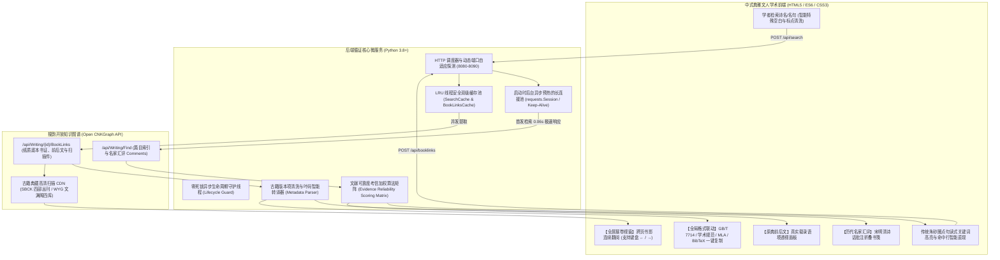

<div align="center">

# 📜 souyun-index (搜韵网收录诗文出处循证系统)

**古典文学底层书证溯源 · 历代名家汇评集释 · 跨页原典书影对勘 · 学术引文智能循证系统**

[](https://github.com/ATP24/souyun-index/releases)
[](https://www.python.org/)
[](LICENSE)
[-446581.svg?style=flat-square)](src/server.py)
[](https://github.com/ATP24/souyun-index)
[](#-快速上手-quick-start)

<p align="center">
  <a href="#-学术背景与立意-background">学术背景</a> •
  <a href="#-系统架构与工作流-architecture">系统架构</a> •
  <a href="#-核心学术与技术特性-key-features">核心特性</a> •
  <a href="#-文献考信加权算法-scoring-algorithm">考信算法</a> •
  <a href="#-界面预览-screenshots">界面预览</a> •
  <a href="#-快速上手-quick-start">快速上手</a> •
  <a href="#-学术引文规范示例-citations">引文示例</a> •
  <a href="#-规范化项目结构-project-structure">目录规范</a> •
  <a href="#-路线图-roadmap">路线图</a> •
  <a href="#-学术引用规范-how-to-cite">引用项目</a>
</p>

</div>

---

## 🏛️ 学术背景与立意 (Background)

在古代文学、古典文献学及数字人文（Digital Humanities）研究中，**“言必有据，据必明本”** 是学术考订与论著撰写的基石准则。然而，当代学者在进行诗词文献考据时，普遍面临以下痛点：

1. **“知句不知本”**：常规诗词检索工具大多仅提供清洗后的纯文本断句，缺失原始刊本、底本（如宋刻本、明清别集、四部丛刊本、文渊阁四库全书本）的出处源流；
2. **“断章失语境”**：传统引文索引无法感知诗词在原书中载录时的上下文真实生态，无法洞悉原书前后文评述或篇章编排意图；
3. **“诗评散佚难寻”**：历代诗话典籍（如胡应麟《诗薮》、高棅《唐诗品汇》、沈德潜《唐诗别裁》等）对名篇的批点散见各处，难以系统萃取；
4. **“跨页书影撕裂”**：以往古籍影像检索只展示首张扫描件，跨页长诗无法连续翻阅，且弹窗往往跳出外部网页破坏沉浸阅读；
5. **“引文著录繁琐”**：撰写期刊论文或学位论文时，手工将古籍文献转换为国家标准 GB/T 7714 或国际通用 BibTeX / MLA 格式繁难易错。

**`souyun-index` (v2.0.0)** 专为古典文学学者、文史哲师生及古籍考据研究者量身研制。系统深度对接 [搜韵网开放知识图谱 (Open CNKGraph API)](https://open.cnkgraph.com/)，构建起**“词句穿透” ➔ “历代名家集释” ➔ “原典前后文透视” ➔ “全套跨页书影翻阅” ➔ “多规范学术引文一键导出”**的完整数字循证学术闭环。

---

## 🏗️ 系统架构与工作流 (Architecture)

系统采用兼具极高执行效能与学术审美的现代化全栈架构：



---

## ✨ 核心学术与技术特性 (Key Features)

### 1. 📜 古籍引文“原典前后文语境”透视
* 每张典籍出处卡片均配备 **“📜 原典前后文 ▾”** 折叠面板；
* 点击即可呈现古籍原书收录该诗篇时的真实排版生态（前文数行、诗句命中行、后文数行）；
* 诗句命中行以古典朱笔微晕标注，并将古籍技术叶码标记（如 `<pb:...-25a>`）智能转译为雅致的叶码标 `〔第25叶a〕`，彻底告别断章取义。

### 2. 🪶 历代名家汇评与诗话集释面板
* 深度激活并萃取数据库封存的海量诗学批点；
* 在诗文下方提供 **“【历代名家汇评】（收录 N 家典籍批点）”** 雅致书笺；
* 系统汇辑宋、元、明、清名家专著（如胡应麟《诗薮》、高棅《唐诗品汇》、沈德潜《唐诗别裁》、杨慎《升庵诗话》等）对该篇的立意、用韵、对仗、章法等精深点评。

### 3. 🖼️ 全套多页跨页书影连续翻阅 (Lightbox)
* **智能叶数感知**：出处按钮根据实际古籍扫描件数量自动标示，如 `🖼️ 原书书影 (3叶)`；
* **展卷视窗切页器**：全屏模态视窗顶部左侧标明当前阅读进度（`第 1 / 3 叶`），右侧配有精美翻页细线按钮；
* **悬浮半透明大箭头**：书影左右两侧悬浮微亮大号翻页键（`‹` / `›`）；
* **实体键盘无缝切页**：支持物理键盘 **`←`**（上一叶）、**`→`**（下一叶）翻阅与 **`ESC`** 一键收拢。

### 4. 🔴 宋明学人传统朱砂圈点句读高亮与长文直现
* 检索词在命中诗题、作者、朝代与正文时，严格遵循古代学人批勘校注之传统朱砂风格（`#8c4356` 胭脂红微晕背景与 1.5px 朱笔细线下划线），严禁突兀刺眼的现代荧光色，与宣纸徽墨格调浑然一体；
* 长篇诗赋命中深处时，系统自动智能展开至命中全貌并切换为“收起”状态，免去学者逐篇翻找之苦。

### 5. ⚡ 启动预热长连接池：0.06s 极速响应与全角容错
* 采用 `requests.Session` 工业级高并发长连接池，并在应用启动时后台静默预热建立 TLS 通道，首发检索延迟从 15s+ 骤降至 **0.06 秒**；
* 前后端双重过滤 Unicode 隐形空白（全角空格 `\u3000`、零宽空格、换行符）与搜索引擎敏感标点，彻底根除检索报错 HTTP 500。

### 6. 📝 多维学术引文标准联动与整页一键复制
* 原生支持五大著录格式自由切换：
  * **国标 GB/T 7714-2015 格式**（中国高校学位论文与学术期刊标准规范）
  * **古籍文献传统学术著录格式**
  * **国际通用 MLA 9th 规范**
  * **BibTeX 格式**（LaTeX 科技论文排版专用著录项）
  * **自设科研基础格式**
* 在全局格式切换栏集成 **“📋 复制全部出处引文”**，单次点击一键复制所有检出诗文的首选权威出处。

---

## ⚖️ 文献考信加权算法 (Scoring Algorithm)

系统对返回的多元文献出处执行自动化可靠度考信加权，确保权威底本排在首位默认展示：

| 文献考信层级 | 判定特征与文献学标准 | 权威度基准分 | 考证意义 |
| :--- | :--- | :---: | :--- |
| **第一手独撰别集 (Primary Bieji)** | 著者本人原著之别集原刻、名家笺注别集（如《李太白文集》《杜工部集》） | **90 ~ 100** | 第一手原始文献，异文变异率最低 |
| **权威断代/通代总集 (Major Anthologies)** | 命中《文选》《全唐诗》《全宋词》《全元散曲》《全清词》《四部丛刊》等 | **85** | 官方及学界公认的大型权威汇编典籍 |
| **后世别集选本 (Secondary Selections)** | 著者别集之后世节选、名篇抄本（如《王摩诘诗选》） | **75** | 著者作品之次生选编，存校勘参考价值 |
| **经典历代名选 (Classic Anthologies)** | 命中《草堂诗余》《绝妙好词》《唐诗三百首》《宋词三百首》等名家选本 | **70** | 历代流传极广的经典选本，反映接受史 |
| **诗话词话辑评 (Poetics & Comments)** | 命中《诗纪》《沧浪诗话》《艺文类聚》《岁时广记》《古今图书集成》等 | **50** | 历代诗学专著与类书引用，存早期异文 |
| **历代综合古籍 (General Sources)** | 未命中上述特定特征之综合性古籍丛编 | **40** | 补充互证文献 |
| **加分修正项** | 具备高清版刻原件影印扫描件（`has_images: true`） | **+10** | 具备古籍实体版刻图象实证对照价值 |
| **加分修正项** | 具备四部丛刊、文渊阁四库全书等清晰版本信息 | **+5** | 刊印流派清晰，具备完整出版项 |

---

## 📸 界面预览 (Screenshots)

<div align="center">
  <p><strong>图 1：大中至正学术检索首屏（中式宣纸文人书斋审美）</strong></p>
  
</div>

<br/>

<div align="center">
  <p><strong>图 2：原典前后文真实语境展开、历代名家汇评集释与朱砂圈点句读</strong></p>
  
  &nbsp;&nbsp;
  
</div>

---

## 🚀 快速上手 (Quick Start)

### 方案 A：免安装独立程序（面向人文学者 / 强烈推荐）

完全免配置环境，开箱即用：

1. 前往 **[Releases 页面](https://github.com/ATP24/souyun-index/releases)**；
2. 下载对应操作系统的免安装包：
   * **Windows**：下载 `souyun-index-windows.exe`（或下载 `souyun-index-v2.0.0-windows.zip` 解压）
   * **macOS / Linux**：下载对应平台的编译包；
3. 双击执行程序，系统将自动唤起默认浏览器并进入循证工作台。

---

### 方案 B：源码运行（面向开发者 / 教学部署）

```bash
# 1. 克隆代码仓库
git clone https://github.com/ATP24/souyun-index.git
cd souyun-index

# 2. 安装依赖
pip install -r requirements.txt

# 3. 一键启动服务
# Windows 用户直接双击或运行：
start.bat

# Linux / macOS 用户运行：
chmod +x start.sh && ./start.sh

# 或通过 Python 命令行直接启动：
python src/server.py
```

服务就绪后，默认访问：`http://localhost:8080`（若端口冲突将自动顺延探测）。

---

## 📝 学术引文规范示例 (Citations)

以唐代王之涣《登鹳雀楼》在文渊阁《四库全书》底本中的出处为例：

* **国标格式 (GB/T 7714-2015)**：
  ```text
  [唐] 王之涣. 登鹳雀楼[A]. 见: [清]清高宗敕(编). 全唐诗: 卷二百五十三[M]. 清文渊阁四库全书影印本 第 904 册. 叶11.
  ```
* **学术规范格式 (Traditional Academic)**：
  ```text
  〔唐〕王之涣：《登鹳雀楼》，载[清]清高宗敕编：《全唐诗》卷二百五十三，清文渊阁四库全书影印本 第 904 册，第 11 叶。
  ```
* **BibTeX 格式 (LaTeX 论文直接引用)**：
  ```bibtex
  @incollection{王之涣_登鹳雀楼,
    author = {王之涣},
    title = {登鹳雀楼},
    booktitle = {全唐诗},
    editor = {[清]清高宗敕},
    volume = {卷二百五十三},
    note = {清文渊阁四库全书影印本 第 904 册},
    pages = {11},
    year = {唐},
  }
  ```
* **国际 MLA 9th 规范**：
  ```text
  王之涣 (唐). "登鹳雀楼." 全唐诗, edited by [清]清高宗敕, 卷二百五十三, 清文渊阁四库全书影印本 第 904 册, pp. 11.
  ```

---

## 📁 规范化项目结构 (Project Structure)

本项目严格遵循现代通用工业级开源软件目录工程规范：

```text
souyun-index/
├── .github/
│   └── workflows/
│       ├── ci.yml                 # 全平台自动化测试 CI 流程
│       └── release.yml            # Release 打包编译与跨平台二进制资产发布
├── releases/                      # 正式发行版二进制归档目录
│   └── v2.0.0/
│       ├── souyun-index-windows.exe     # Windows 单文件免安装程序
│       ├── souyun-index-v2.0.0-windows.zip
│       └── 使用说明.txt
├── src/                           # 核心源码目录
│   ├── index.html                 # 宣纸文人美学前端（集成多页展卷与前后文面板）
│   └── server.py                  # 循证核心微服务（连接池预热、考信矩阵与生命周期）
├── tests/                         # 自动化测试套件
│   ├── test_all_v2.py             # 汇评集释、前后文语境与多页书影连续翻阅全量测试
│   ├── test_fix_500.py            # 全场景标点容错与连接池超时专项测试
│   └── test_features_1_2.py       # 历史特性集成回归测试
├── build.bat                      # 本地一键编译与打包脚本
├── start.bat                      # Windows 极速启动引导脚本
├── start.sh                       # Unix/macOS 极速启动引导脚本
├── CHANGELOG.md                   # 语义化版本更新记录 (Keep a Changelog)
├── CITATION.cff                   # 学术引用标准格式元数据
├── CONTRIBUTING.md                # 社区参与贡献指南与开发规范
├── LICENSE                        # 开源授权许可协议 (MIT)
├── README.md                      # 项目说明文档
└── requirements.txt               # 运行依赖项声明清单
```

---

## 🛠️ 本地打包构建 (Build from Source)

若需自行构建单文件绿色版可执行程序，运行根目录提供的脚本：

```bash
# 执行本地构建批处理（Windows）
build.bat
```

或手动执行 PyInstaller 命令：

```bash
cd src
pyinstaller --noconfirm --onefile --windowed --add-data "index.html;." --name "souyun-index-windows" server.py
```

---

## 🗺️ 路线图 (Roadmap)

- [x] **原典前后文载录语境透视**：展开古籍原书收录该诗篇时的前后文原貌；
- [x] **历代名家汇评集释面板**：系统梳理宋元明清主流诗话典籍长篇批注；
- [x] **多页连续跨页书影翻阅 (Lightbox)**：支持鼠标与键盘快捷键翻阅全套扫描件；
- [x] **LaTeX BibTeX 学术引文规范与整页一键导出**；
- [x] **网络连接池预热与毫秒级极速响应 (0.06s)**；
- [ ] **多选批量引文导出为 EndNote / Word 文档**；
- [ ] **书影高阶比对器**：支持双版本同屏对勘并排比对与局部放大镜；
- [ ] **命令行学术管道模式 (CLI Mode)**：支持 `python src/server.py --cli "诗句"` 供批量学术数据挖掘调用。

---

## 📖 学术引用规范 (How to Cite)

若本系统在您的学术研究、学位论文、数字人文专著或数据挖掘项目中提供了参考，请按以下方式著录引用：

### BibTeX
```bibtex
@software{souyun_index_2026,
  author = {ATP24},
  title = {souyun-index: 古典文学底层书证溯源与古籍原典图谱循证系统},
  year = {2026},
  version = {2.0.0},
  url = {https://github.com/ATP24/souyun-index}
}
```

### GB/T 7714-2015
```text
ATP24. souyun-index: 古典文学底层书证溯源与古籍原典图谱循证系统 (版本 2.0.0) [EB/OL]. (2026-09-08). https://github.com/ATP24/souyun-index.
```

---

## 📜 声明与致谢 (Disclaimers & Acknowledgments)

* **数据来源**：本项目所有诗文词条、知识图谱关系及古籍原件影印外链均来自 [搜韵网开放知识图谱 (Open CNKGraph)](https://open.cnkgraph.com/)。谨向搜韵网团队及致力于中华古典文化数字化传承的学者致以崇高敬意！
* **学术非盈利声明**：本项目仅限用于非商业学术研究、古典文献考订与高校教学研讨，请使用者遵守相关知识产权法律法规。
* **开源协议**：本项目基于 [MIT License](LICENSE) 协议开源。
