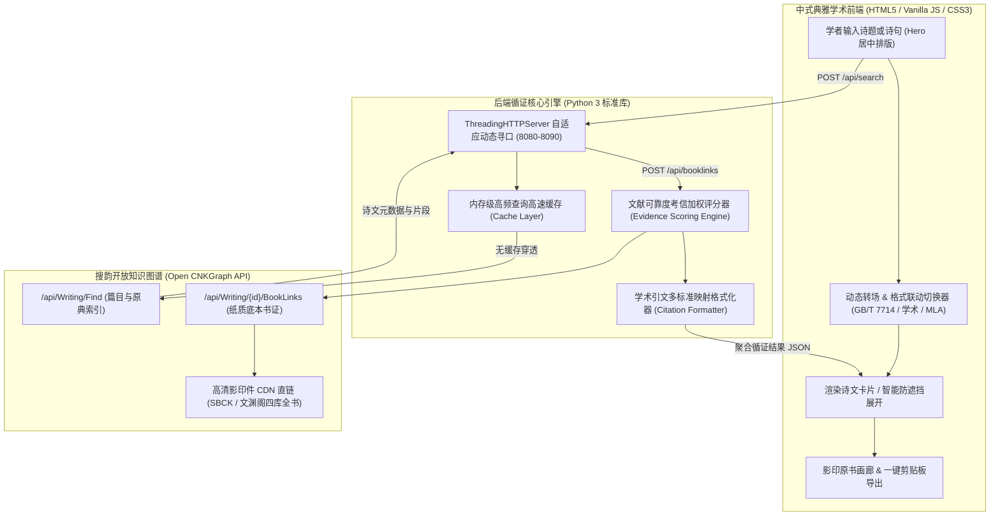

<div align="center">

# 📜 souyun-index (搜韵网收录诗文出处循证系统)

**古典文学底层书证溯源 · 影印古籍原典图谱映射 · 学术引文智能循证系统**

[](https://www.python.org/)
[](LICENSE)
[](src/server.py)
[](https://github.com/ATP24/souyun-index)
[](#-快速上手-quick-start)
[](https://github.com/ATP24/souyun-index/releases)

<p align="center">
  <a href="#-学术背景与立意-background">学术背景</a> •
  <a href="#-系统架构与工作流-architecture">系统架构</a> •
  <a href="#-核心技术特性-key-features">核心特性</a> •
  <a href="#-文献考信加权算法-scoring-algorithm">考信算法</a> •
  <a href="#-界面预览-screenshots">界面预览</a> •
  <a href="#-快速上手-quick-start">快速上手</a> •
  <a href="#-学术引文规范示例-citations">引文示例</a> •
  <a href="#-未来路线图-roadmap">路线图</a>
</p>

</div>

---

## 🏛️ 学术背景与立意 (Background)

在古代文学、古典文献学及数字人文（Digital Humanities）研究中，**“言必有据，据必明本”** 是学术考证与论文撰写的基石准则。然而，当今学术界普遍面临以下研究痛点：

1. **“知句不知本”**：常规诗词检索工具大多仅提供清洗后的纯文本，缺失原始刊本、底本（如宋刻本、明清别集、影印四部丛刊本）的源流信息；
2. **“查证链路繁琐”**：传统文献核验需要学者在古籍索引、总集、别集之间多方翻检，繁难费时；
3. **“引文格式紊乱”**：撰写学位论文或学术专著时，将古籍出处人工转换为《文后参考文献著录规则》（GB/T 7714）或 MLA 等标准格式耗时费力且容易出错。

**`souyun-index`** 专为古典文学研究学者、文史哲师生及古籍考据爱好者研发。系统基于 [搜韵网开放知识图谱 (CNKGraph API)](https://open.cnkgraph.com/)，通过底层多级寻址与元数据聚合技术，实现从**“诗句检索”**到**“底层物理书证定位”**、**“高清影印扫描原典调阅”**与**“多维学术引文标准化生成”**的完整全自动循证闭环。

---

## 🏗️ 系统架构与工作流 (Architecture)

系统采用 **轻量级零第三方依赖（Zero-Dependency）** 微内核设计，兼顾严苛环境的便携性与极高的执行效率。



---

## ✨ 核心技术特性 (Key Features)

* 📚 **古籍实体书证直通映射**：
  跨越常规前端的检索界面，直接穿透至底层图谱实体。自动发掘文献在《四部丛刊》、《四库全书》等大型丛书中的物理卷册与叶码（页码）。
* 🖼️ **原典影印高清 CDN 直链**：
  检索结果中若含有国家图书馆、商务印书馆等机构数字化底本的高清扫描件，卡片直接提供原图索引，支持一键调取原始版刻书影进行对勘。
* ⚖️ **文献考信四级加权模型**：
  内置文献可靠度计算模型（别集 > 权威总集 > 选集诗话 > 普通文集），智能优先推荐第一手底本出处。
* 📝 **多规范学术引文引擎**：
  自动解析卷帙、编者、朝代信息，原生支持一键生成并复制以下著录格式：
  * **国标 GB/T 7714-2015 格式**（中国高校学位论文与学术期刊标准）
  * **古籍文献传统学术著录格式**
  * **国际通用 MLA 9th 规范**
  * **自设科研基础格式**
* 🎨 **纯正中式宣纸美学界面**：
  采用宋体衬线文字体系与东方纸墨配色（宣纸白、徽墨黑、胭脂红、竹青、靛蓝），并自研“自适应渐变防遮挡”折叠算法，长诗短篇阅读皆极度舒适。
* ⚡ **极致零依赖单文件分发**：
  后端纯使用 Python 标准库（`http.server`、`urllib`、`socket`、`json` 等），无需 `pip install` 任何繁杂包，开箱即用，资源消耗极低。

---

## ⚖️ 文献考信加权算法 (Scoring Algorithm)

系统对搜韵知识图谱返回的多元出处执行自动化可靠度评级，确保最原始、最权威的底本排在首位默认展示：

| 文献考信层级 | 判定特征与匹配规则 | 权威度基准分 | 考证意义 |
| :--- | :--- | :---: | :--- |
| **第一级：独撰别集 (Primary Works)** | 著者名匹配书名或编纂者（如《李太白文集》） | **100** | 第一手原始底本，变异率最低 |
| **第二级：权威通代总集 (Major Anthologies)** | 命中《全唐诗》、《全宋诗》、《全上古三代秦汉三国六朝诗》等 | **80** | 官方及学界公认大型辑佚典籍 |
| **第三级：选集与诗话评注 (Selections & Poetics)** | 命中《诗纪》、《诗话》、《词话》、《岁时广记》等 | **50** | 后世品评与选录，多存异文 |
| **第四级：一般古籍与杂纂 (General Sources)** | 未命中上述特征之常规古代典籍 | **40** | 备用互证文献 |
| **加分修正项** | 含有原始影印版刻扫描件（PageImages） | **+10** | 具备图像实证对照价值 |
| **扣分修正项** | 仅有纯文本底层录入来源（Froms）而缺版本信息 | **-5** | 缺乏版本著录，信度次之 |

---

## 📸 界面预览 (Screenshots)

<div align="center">
  <p><strong>图 1：大中至正学术检索首屏（Hero Section 动态交互）</strong></p>
  
</div>

<br/>

<div align="center">
  <p><strong>图 2：底层实体书证透视、多维规范引文生成与版刻书影对照</strong></p>
  
  &nbsp;&nbsp;
  
</div>

---

## 🚀 快速上手 (Quick Start)

### 方案 A：免安装独立程序（面向人文学者 / 推荐）

完全免配置环境，双击即可运行：

1. 前往 **[Releases 页面](https://github.com/ATP24/souyun-index/releases)**；
2. 下载对应操作系统的免安装包：
   * **Windows**：下载 `souyun-index-windows.exe`
   * **macOS**：下载 `souyun-index-mac`（需执行 `chmod +x` 并允许未知开发者运行）
3. 双击执行程序，系统将自动唤起默认浏览器并进入循证工作台。

---

### 方案 B：源码运行（面向开发者 / 部署人员）

```bash
# 1. 克隆代码仓库
git clone https://github.com/ATP24/souyun-index.git
cd souyun-index

# 2. 一键启动服务（系统基于零第三方依赖构建，无需 pip install）
# Windows 用户：
start.bat

# Linux / macOS 用户：
chmod +x start.sh && ./start.sh

# 或通过 Python 命令行直接启动：
cd src
python server.py
```

服务就绪后，默认访问：`http://localhost:8080`（若端口被占用将自动向后探测至 8090）。

---

## 📝 学术引文规范示例 (Citations)

以唐代王之涣《登鹳雀楼》在清文渊阁《四库全书》底本中的出处为例：

* **国标格式 (GB/T 7714-2015)**：
  ```text
  [唐] 王之涣. 登鹳雀楼[A]. 见: 清高宗敕(编). 全唐诗: 卷二百五十三[M]. 清文渊阁四库全书影印本 第 904 册. 叶11.
  ```
* **学术规范格式 (Academic Citation)**：
  ```text
  〔唐〕王之涣：《登鹳雀楼》，载[清]清高宗敕编：《全唐诗》卷二百五十三，清文渊阁四库全书影印本 第 904 册，第 11 叶。
  ```
* **MLA 9th 规范**：
  ```text
  王之涣 (唐). "登鹳雀楼." 全唐诗, edited by [清]清高宗敕, 卷二百五十三, 清文渊阁四库全书影印本 第 904 册, pp. 11.
  ```

---

## 🛠️ 本地构建与打包 (Build & Package)

若需自行构建独立无依赖可执行程序：

```bash
# 安装打包工具
pip install pyinstaller

# Windows 构建（生成于 src/dist/souyun-index-windows.exe）
pyinstaller --noconfirm --onefile --windowed --add-data "index.html;." --name "souyun-index-windows" src/server.py

# macOS / Linux 构建
pyinstaller --noconfirm --onefile --windowed --add-data "index.html:." --name "souyun-index" src/server.py
```

项目已配置 GitHub Actions 持续集成工作流（`.github/workflows/release.yml`），每次创建 Release 标签时将自动在云端完成跨平台编译并发布二进制资产。

---

## 🗺️ 未来路线图 (Roadmap)

- [ ] **多选批量引文导出**：支持勾选多篇诗作，一键导出为 BibTeX / EndNote / Word 参考文献列表；
- [ ] **内嵌版刻书影对勘器**：无需跳出当前页面，在侧边栏以 Lightbox 形式支持版刻原图的高清缩放、旋转与文本对勘；
- [ ] **考信算法词库扩充**：扩充宋元明清主流别集、地方志、石刻文献与总目提要的规则匹配库；
- [ ] **历史检索记录持久化**：采用纯前端 LocalStorage 实现本地历史足迹与一键回溯；
- [ ] **RESTful 命令行导出工具 (CLI Mode)**：增加 `python server.py --cli "诗句"` 模式，便于大批量学术数据管线调用。

---

## 🤝 参与贡献 (Contributing)

诚挚欢迎文史人文学者与开发界同仁共同完善这一数字人文基础设施：

1. **Fork** 本仓库并创建特性分支 (`git checkout -b feature/AmazingFeature`)；
2. 提交代码与算法改进 (`git commit -m 'feat: add support for modern edition tagging'`)；
3. 推送分支至您的远程仓库 (`git push origin feature/AmazingFeature`)；
4. 开启 **Pull Request** 并详细说明考证逻辑或改进场景。

---

## 📜 声明与致谢 (Disclaimers & Acknowledgments)

* **数据来源**：本项目所有诗文词条、知识图谱关系及古籍原件影印外链均来自 [搜韵网开放知识图谱 (Open CNKGraph)](https://open.cnkgraph.com/)。谨向搜韵网团队及致力于中华古典文化数字化传承的学者致以崇高敬意！
* **学术非盈利声明**：本项目仅限用于非商业学术研究、古典文献考订与教学研讨，请使用者遵守相关知识产权法律法规。
* **开源协议**：本项目基于 [MIT License](LICENSE) 协议完全开源。
